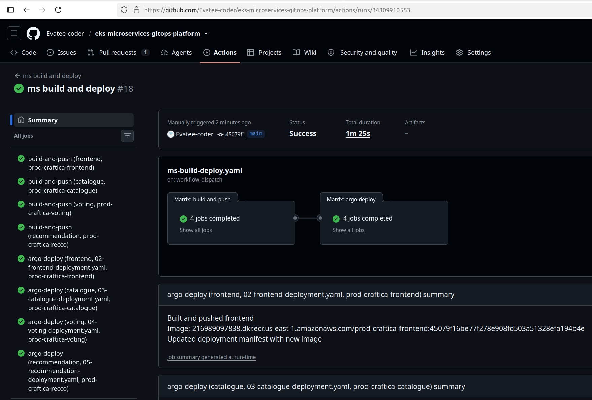
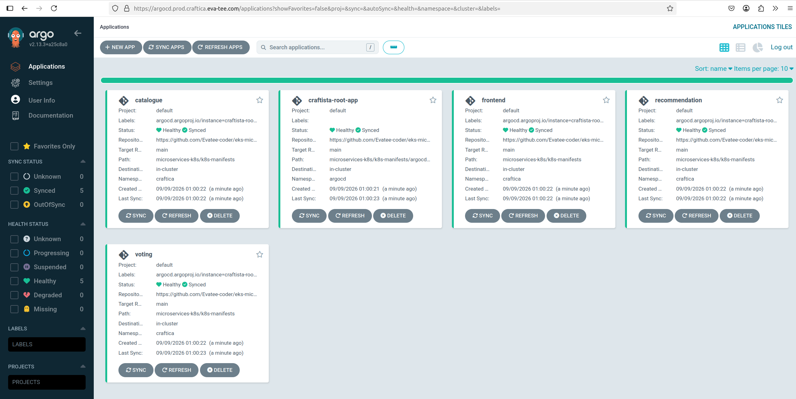
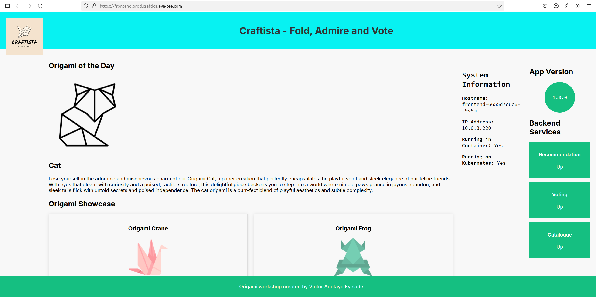
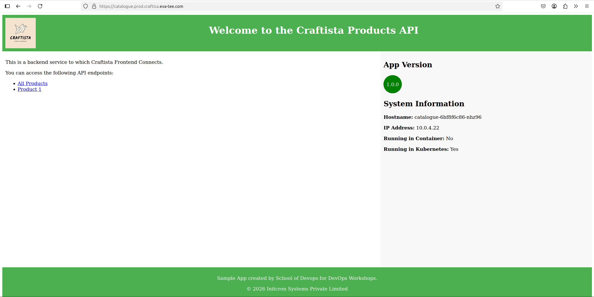
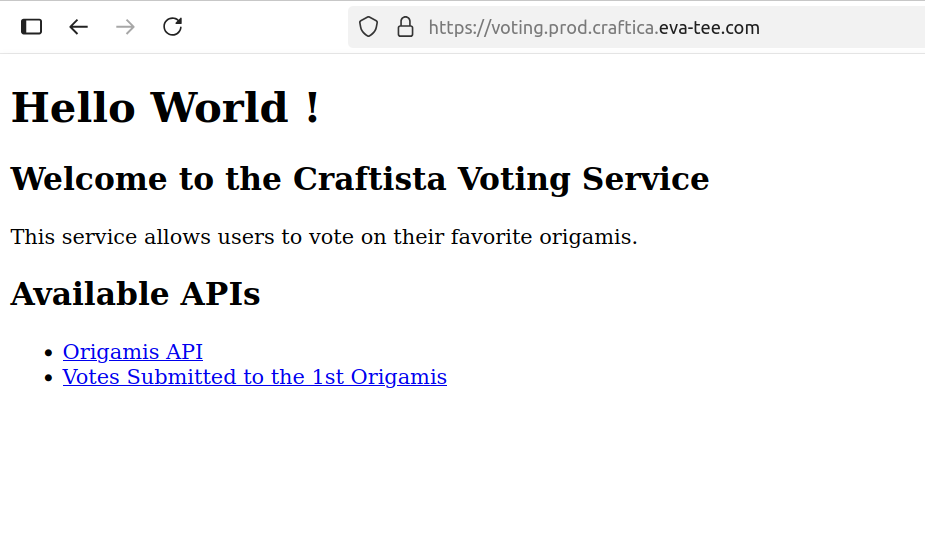
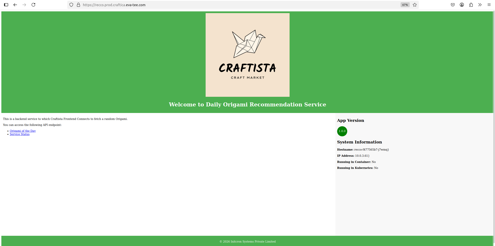
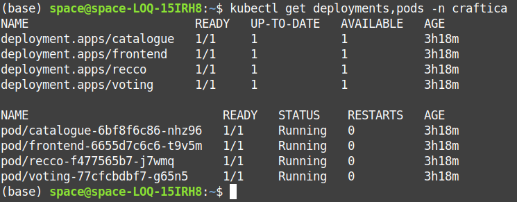
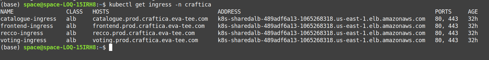

# Craftica — GitOps Delivery Platform on Amazon EKS


Production-style GitOps delivery platform combining **Terraform, Amazon EKS, GitHub Actions, OIDC federation, Amazon ECR, Kubernetes, and ArgoCD** to provision infrastructure, build containerized microservices, and continuously reconcile application deployments from Git.

> **Core engineering pattern:** Terraform provisions the platform, GitHub Actions builds and publishes immutable container images, and ArgoCD continuously reconciles Kubernetes workloads from Git.

---

## Table of Contents

- [Overview](#overview)
- [Architecture](#architecture)
- [Deployment & Validation](#deployment--validation)
  - [CI/CD — GitHub Actions](#cicd--github-actions)
  - [GitOps — ArgoCD App-of-Apps](#gitops--argocd-app-of-apps)
  - [Application Outputs](#application-outputs)
  - [EKS Workload Health](#eks-workload-health)
  - [Ingress and Application Load Balancer](#ingress-and-application-load-balancer)
- [Project Highlights](#project-highlights)
- [Tech Stack](#tech-stack)
- [Key Engineering Decisions](#key-engineering-decisions)
- [Security Design](#security-design)
- [CI/CD and GitOps Workflow](#cicd-and-gitops-workflow)
- [Responsibility Boundaries](#responsibility-boundaries)
- [Engineering Challenges and Lessons](#engineering-challenges-and-lessons)
- [Deployment](#deployment)
  - [Prerequisites](#prerequisites)
  - [Provision VPC and EKS](#1-provision-vpc-and-eks)
  - [Configure Kubernetes Access](#2-configure-kubernetes-access)
  - [Provision Cluster Services](#3-provision-cluster-services)
  - [Provision Application Infrastructure](#4-provision-application-infrastructure)
  - [Bootstrap ArgoCD App-of-Apps](#5-bootstrap-argocd-app-of-apps)
  - [Verify Deployment](#6-verify-deployment)
  - [Access ArgoCD](#7-access-argocd)
- [Teardown](#teardown)
- [Skills Demonstrated](#skills-demonstrated)
- [Future Improvements](#future-improvements)
- [Author](#author)

## Overview

Craftica demonstrates a GitOps-based delivery architecture for running containerized microservices on Amazon EKS.

The platform separates **infrastructure provisioning, continuous integration, and application delivery** into independent responsibility boundaries:

| Responsibility | Technology |
|---|---|
| Infrastructure provisioning | Terraform |
| CI and container builds | GitHub Actions |
| AWS authentication from CI | OIDC federation |
| Container registry | Amazon ECR |
| Continuous delivery | ArgoCD |
| Container orchestration | Amazon EKS / Kubernetes |
| Ingress and load balancing | AWS Load Balancer Controller / ALB |
| DNS and TLS | Route53 / ACM |
| Data persistence | Amazon RDS PostgreSQL |

The platform deploys four independently managed microservices:

- **frontend** — Node.js / Express
- **catalogue** — Python / Flask + Gunicorn with PostgreSQL persistence
- **voting** — Java / Spring Boot
- **recommendation** — Go / Gin

Application traffic enters through a shared Application Load Balancer using host-based routing and TLS termination with an ACM wildcard certificate.

The architecture intentionally separates three control planes:

- **Terraform** owns long-lived AWS infrastructure and cluster dependencies.
- **GitHub Actions** owns container build, immutable image tagging, and publishing to Amazon ECR.
- **ArgoCD** owns Kubernetes application delivery and continuous reconciliation.

Application releases therefore do not require Terraform changes, while infrastructure provisioning remains outside the GitOps application-delivery lifecycle.

---

## Architecture


---

## Deployment & Validation 

The following outputs validate the end-to-end delivery path from CI image builds through GitOps reconciliation to healthy workloads running on Amazon EKS.

**GitHub Actions → Amazon ECR → Git → ArgoCD → Amazon EKS → ALB**

### CI/CD — GitHub Actions

<p align="center">
  
</p>

<p align="center">
  <em>GitHub Actions successfully building and publishing the four microservice container images.</em>
</p>

### GitOps — ArgoCD App-of-Apps

<p align="center">
  
</p>

<p align="center">
  <em>ArgoCD App-of-Apps showing the microservice applications synchronized and healthy.</em>
</p>

### Application Outputs

<table>
  <tr>
    <td align="center">
      <strong>Frontend</strong><br>
      
    </td>
    <td align="center">
      <strong>Catalogue</strong><br>
      
    </td>
  </tr>
  <tr>
    <td align="center">
      <strong>Voting</strong><br>
      
    </td>
    <td align="center">
      <strong>Recommendation</strong><br>
      
    </td>
  </tr>
</table>

### EKS Workload Health

<p align="center">
  
</p>

<p align="center">
  <em>Microservice deployments and pods running successfully on Amazon EKS.</em>
</p>

### Ingress and Application Load Balancer

<p align="center">
  
</p>

<p align="center">
  <em>Host-based Kubernetes Ingress routes exposing the applications through the shared AWS Application Load Balancer.</em>
</p>

## Project Highlights

- **GitOps-based application delivery** using ArgoCD with automatic synchronization, self-healing, and pruning.
- **ArgoCD App-of-Apps architecture** separating four microservices into independently reconciled child applications.
- **OIDC-federated CI authentication** allowing GitHub Actions to access AWS without storing long-lived AWS access keys.
- **IRSA-based AWS authentication** for the AWS Load Balancer Controller using the EKS OIDC provider and a dedicated Kubernetes ServiceAccount.
- **Immutable container deployments** using Git commit SHA image tags instead of `latest`.
- **Terraform state isolation** separating cluster infrastructure, cluster services, CI identity, and application infrastructure into independent lifecycle boundaries.
- **Three-tier network segmentation** separating public ingress, private compute, and isolated database resources.
- **Shared ALB architecture** consolidating multiple Kubernetes Ingress resources behind one Application Load Balancer using host-based routing.
- **TLS and DNS automation** using Amazon ACM and Route53.
- **Environment-specific Terraform configuration** using `.tfvars` and backend configuration files, with production deployment enabled and development infrastructure intentionally cost-controlled.

---

## Tech Stack

| Category | Technologies |
|---|---|
| **Cloud Platform** | AWS |
| **Infrastructure as Code** | Terraform, S3 Remote State, `terraform-aws-modules/vpc`, `terraform-aws-modules/eks` |
| **Container Orchestration** | Amazon EKS, Kubernetes, EC2 Managed Node Groups |
| **GitOps** | ArgoCD, App-of-Apps, Automated Sync, Self-Heal, Prune |
| **CI/CD** | GitHub Actions, GitHub OIDC, Docker Buildx |
| **Containers & Registry** | Docker, Amazon ECR |
| **Identity & Access** | AWS IAM, OIDC Federation, IRSA |
| **Networking** | Amazon VPC, Public/Private/Database Subnets, NAT Gateway, Internet Gateway, Security Groups |
| **Ingress & Load Balancing** | AWS Load Balancer Controller, Application Load Balancer, Kubernetes Ingress |
| **DNS & TLS** | Amazon Route 53, AWS Certificate Manager (ACM) |
| **Database** | Amazon RDS for PostgreSQL |
| **Security & Secrets** | AWS KMS, AWS Secrets Manager, IAM Trust Policies |
| **Kubernetes Configuration** | Deployments, Services, Ingress, ConfigMaps, Secrets, Liveness/Readiness Probes |
| **Application Stack** | Node.js/Express, Python/Flask/Gunicorn, Java/Spring Boot, Go/Gin |
| **Observability Readiness** | Prometheus-format application metrics |

---

## Key Engineering Decisions

### 1. Separate Infrastructure Provisioning from Application Delivery

Terraform owns AWS infrastructure and cluster-level dependencies, while ArgoCD owns Kubernetes workload reconciliation.

Application deployments therefore do not require a Terraform state lock or `terraform apply`.

```text
Terraform      → Infrastructure
GitHub Actions → Build and Publish
ArgoCD         → Application Delivery
Kubernetes     → Runtime
```

**Why:** Infrastructure and application releases operate at different rates and should not share the same deployment lifecycle.

**Trade-off:** Multiple control loops must remain aligned, particularly Git branches, image references, and ArgoCD target revisions.

### 2. App-of-Apps Instead of a Monolithic ArgoCD Application

A root ArgoCD `Application` discovers four child applications, with each microservice maintaining its own synchronization and health state.

**Why:** Services can be deployed and reconciled independently without modifying a single monolithic application definition.

**Trade-off:** Shared configuration such as `targetRevision` must remain consistent across the root and child applications.

### 3. OIDC Federation Instead of Long-Lived AWS Credentials

GitHub Actions assumes an AWS IAM role using GitHub's OIDC provider.

The AWS Load Balancer Controller independently assumes its AWS role through IRSA and the EKS OIDC provider.

**Why:** This eliminates the need to store persistent AWS access keys in GitHub Actions or Kubernetes configuration.

**Trade-off:** OIDC trust relationships require more deliberate IAM configuration than static credentials.

### 4. Terraform State Boundaries Based on Resource Lifecycle

Terraform state is separated across cluster infrastructure, cluster services, CI identity, and application infrastructure.

**Why:** Resources that should not be created or destroyed together should not share the same lifecycle boundary.

This design was reinforced by an infrastructure incident where shared state caused unrelated resources to become part of the same destructive operation.

### 5. Shared ALB for Multiple Kubernetes Applications

All application Ingress resources use a common AWS Load Balancer Controller ingress group.

This consolidates multiple host-based routes behind one ALB and one wildcard ACM certificate.

**Why:** It reduces unnecessary load balancer duplication while retaining independent Kubernetes Ingress definitions for each service.

**Trade-off:** Services share the availability and configuration boundary of the ALB.

---

## Security Design

Security is implemented across identity, network, transport, and data layers.

### Identity and Access

- GitHub Actions authenticates to AWS through OIDC federation.
- No long-lived AWS access keys are stored in CI configuration.
- AWS Load Balancer Controller uses IRSA.
- IRSA trust is scoped to a specific Kubernetes ServiceAccount.
- GitHub OIDC trust is restricted to the repository.

### Network Security

```text
Internet
   ↓
ALB
   ↓
EKS Node Security Group
   ↓
RDS Security Group
```

- EKS worker nodes operate in private subnets.
- RDS runs in isolated database subnets.
- RDS has no direct internet route.
- PostgreSQL port `5432` accepts traffic only from the EKS node security group.

### Encryption and Transport Security

- HTTPS terminates at the ALB.
- ACM provides the wildcard TLS certificate.
- HTTP traffic is redirected to HTTPS.
- RDS storage is encrypted using a customer-managed KMS key.
- Database connection information is stored in AWS Secrets Manager.

### Current Security Trade-offs

The infrastructure-provisioning GitHub Actions role currently has broader permissions than a dedicated container-build role would require.

A production-hardening step would split these responsibilities into separate IAM roles:

```text
CI Build Role
    └── ECR image operations

Infrastructure Role
    └── Terraform provisioning permissions
```

---

## CI/CD and GitOps Workflow

The repository contains three primary GitHub Actions workflows.

### Pull Request Validation

`on-pr.yaml`

Runs Terraform formatting validation and planning for infrastructure changes before merge.

```text
Pull Request
    ↓
terraform fmt
    ↓
terraform plan
    ↓
Review
```

### Infrastructure Deployment

`eks-deploy.yaml`

Uses manual `workflow_dispatch` inputs to control:

- Environment
- Apply or destroy operation
- Terraform module path

Infrastructure changes are therefore explicit rather than automatically executed on every merge.

### Microservice Build and Delivery

`ms-build-deploy.yaml`

Builds the four microservices using a GitHub Actions matrix strategy.

Each container image is tagged with the full Git commit SHA and pushed to Amazon ECR.

```text
GitHub Actions
      ↓
Matrix Build
      ├── frontend
      ├── catalogue
      ├── voting
      └── recommendation
      ↓
Amazon ECR
      ↓
Manifest Image Tag Update
      ↓
Git
      ↓
ArgoCD
      ↓
EKS
```

### Immutable Image Versioning

Images use:

```yaml
${{ github.sha }}
```

instead of `latest`.

This provides traceability between source commits and deployed container images.

### GitOps Reconciliation

ArgoCD continuously monitors the Git repository.

Child applications use automated synchronization with:

```yaml
automated:
  prune: true
  selfHeal: true
```

When the desired state in Git changes, ArgoCD reconciles the corresponding Kubernetes workload without requiring CI to directly execute `kubectl apply`.

---

## Responsibility Boundaries

| Layer | Responsibility | Tool |
|---|---|---|
| Network | VPC, subnets, routing, NAT/IGW | Terraform |
| Compute | EKS cluster and managed nodes | Terraform |
| Cluster services | AWS Load Balancer Controller, ArgoCD installation | Terraform / Helm |
| Identity | IAM, OIDC, IRSA | Terraform |
| Data | RDS, KMS, Secrets Manager | Terraform |
| Registry | Amazon ECR | Terraform |
| Build | Container build and tagging | GitHub Actions |
| Publish | Push images to ECR | GitHub Actions |
| Desired application state | Kubernetes manifests in Git | Git |
| Continuous delivery | Reconciliation and synchronization | ArgoCD |
| Runtime | Pods, Services, scheduling | Kubernetes / EKS |

Terraform does not deploy application manifests, and ArgoCD does not provision AWS infrastructure.

---

## Engineering Challenges and Lessons

### 1. Shared Terraform State Coupled Unrelated Infrastructure

**Problem:** An infrastructure operation unexpectedly affected the AWS Load Balancer Controller and RDS resources outside the intended change.

**Root Cause:** Independent infrastructure components shared a Terraform backend state, creating an unintended lifecycle relationship between resources.

**Resolution:** Terraform state was separated by component and environment using independent S3 backend keys.

The resulting boundaries isolate:

- EKS cluster infrastructure
- Cluster services
- GitHub OIDC / CI identity
- Application infrastructure

**Engineering Lesson:** Terraform state boundaries are architecture boundaries. Resources that should not be destroyed, recreated, or managed together should not share state simply because they belong to the same platform.

### 2. CI Identity Shared the Cluster Lifecycle

**Problem:** Destroying EKS infrastructure also removed the GitHub Actions OIDC IAM role required to provision that infrastructure.

**Root Cause:** The provisioning identity existed in the same Terraform lifecycle as the infrastructure it controlled.

**Resolution:** The GitHub OIDC role and associated policies were moved into independent Terraform state.

**Engineering Lesson:** Provisioning identities should survive the lifecycle of the resources they manage. A pipeline responsible for rebuilding a cluster should not disappear when that cluster is destroyed.

### 3. ArgoCD Target Revision Drift

**Problem:** The root ArgoCD application and child applications referenced different Git branches.

**Root Cause:** Each `Application` stored `targetRevision` independently, allowing the App-of-Apps hierarchy to drift as branch configuration changed.

**Resolution:** The root and all child applications were realigned to the same intended revision.

**Engineering Lesson:** Configuration duplicated across GitOps application definitions becomes a potential drift point. Values that are logically global should either be generated centrally or validated automatically.

---

## Deployment Evidence

The following outputs demonstrate the complete delivery path from CI image builds through GitOps reconciliation to running workloads on Amazon EKS.

### GitHub Actions — Microservices Build and Publish

The `ms-build-deploy.yaml` workflow builds the four microservices, tags each container image with the Git commit SHA, and publishes the images to Amazon ECR.

<p align="center">
  
</p>

<p align="center">
  <em>GitHub Actions matrix workflow successfully building and publishing the four microservice images.</em>
</p>

---

### ArgoCD — App-of-Apps GitOps Deployment

The root ArgoCD application manages the four microservice child applications independently through the App-of-Apps pattern.

<p align="center">
  
</p>

<p align="center">
  <em>ArgoCD App-of-Apps topology showing the microservice applications synchronized with the desired state in Git.</em>
</p>

---

### Frontend Service

**Runtime:** Node.js / Express

<p align="center">
  
</p>

<p align="center">
  <em>Node.js/Express frontend successfully deployed to Amazon EKS and exposed through the shared Application Load Balancer.</em>
</p>

---

### Catalogue Service

**Runtime:** Python / Flask + Gunicorn  
**Data Store:** Amazon RDS for PostgreSQL

<p align="center">
  
</p>

<p align="center">
  <em>Python/Flask catalogue service running on Amazon EKS with persistent data provided by Amazon RDS for PostgreSQL.</em>
</p>

---

### Voting Service

**Runtime:** Java / Spring Boot

<p align="center">
  
</p>

<p align="center">
  <em>Java/Spring Boot voting service successfully deployed and routed through the shared ALB using Kubernetes Ingress.</em>
</p>

---

### Recommendation Service

**Runtime:** Go / Gin

<p align="center">
  
</p>

<p align="center">
  <em>Go/Gin recommendation service running as an independently managed Kubernetes workload on Amazon EKS.</em>
</p>

---

### Kubernetes Workload Health

<p align="center"> 
   
</p> 

<p align="center"> 
 <em>Amazon EKS workload health showing the Craftica microservice pods successfully running and ready in the Kubernetes cluster.</em> 
</p>

### Kubernetes Ingress — Shared Application Load Balancer
<p align="center"> 
  
</p> 

<p align="center"> 
 <em>Kubernetes Ingress resources exposing the microservices through a shared AWS Application Load Balancer with host-based routing.</em> 
</p>
---

## Deployment

### Prerequisites

- AWS CLI
- Terraform >= 1.13.1
- `kubectl`
- AWS permissions required to provision the infrastructure
- Access to the GitHub repository
- Existing Route53 public hosted zone for the target domain

### Clone the Repository

```bash
git clone https://github.com/Evatee-coder/eks-microservices-gitops-platform.git

cd eks-microservices-gitops-platform
```

### 1. Provision VPC and EKS

```bash
cd eks-proper-infra/eks_cluster_infra

terraform init -backend-config=vars/prod.tfbackend
terraform validate
terraform plan -var-file=vars/prod.tfvars
terraform apply -var-file=vars/prod.tfvars
```

### 2. Configure Kubernetes Access

```bash
aws eks update-kubeconfig \
  --name prod-microservices-ekscluster \
  --region us-east-1

kubectl get nodes
```

### 3. Provision Cluster Services

```bash
cd ../eks_services

terraform init -backend-config=vars/prod.tfbackend
terraform plan -var-file=vars/prod.tfvars
terraform apply -var-file=vars/prod.tfvars
```

### 4. Provision Application Infrastructure

```bash
cd ../../microservices-k8s/infra

terraform init -backend-config=vars/prod.tfbackend
terraform plan -var-file=vars/prod.tfvars
terraform apply -var-file=vars/prod.tfvars
```

### 5. Bootstrap ArgoCD App-of-Apps

```bash
kubectl apply \
  -f ../k8s-manifests/argocd-apps/apps/root-app.yaml
```

### 6. Verify Deployment

```bash
kubectl get applications -n argocd
kubectl get pods -n craftica
kubectl get ingress -n craftica
```

### 7. Access ArgoCD

```bash
kubectl -n argocd get secret \
  argocd-initial-admin-secret \
  -o jsonpath="{.data.password}" | base64 -d
```

```bash
kubectl port-forward \
  svc/argocd-server \
  -n argocd \
  8080:443
```

---

## Teardown

Destroy infrastructure in reverse dependency order:

```bash
cd microservices-k8s/infra
terraform destroy -var-file=vars/prod.tfvars

cd ../../eks-proper-infra/eks_services
terraform destroy -var-file=vars/prod.tfvars

cd ../eks_cluster_infra
terraform destroy -var-file=vars/prod.tfvars
```

The `eks-deploy.yaml` GitHub Actions workflow can also perform infrastructure apply and destroy operations through manual workflow dispatch.

---

## Skills Demonstrated

| Area | Demonstrated Capability |
|---|---|
| **Infrastructure as Code** | Terraform modules, remote state, lifecycle isolation, conditional provisioning |
| **AWS Architecture** | VPC, EKS, ECR, RDS, IAM, Route53, ACM, KMS, Secrets Manager |
| **Kubernetes** | Deployments, Services, Ingress, probes, ConfigMaps, Secrets |
| **GitOps** | ArgoCD App-of-Apps, automated sync, self-healing, pruning |
| **CI/CD** | GitHub Actions, matrix builds, immutable image tagging |
| **Cloud Identity** | OIDC federation, IRSA, IAM trust relationships |
| **Networking** | Public/private/database segmentation, ALB ingress, DNS/TLS |
| **Security** | Private compute, database isolation, KMS encryption, federated identity |
| **Troubleshooting** | Terraform state coupling, IAM lifecycle design, GitOps revision drift |
| **Platform Engineering** | Separation of infrastructure, CI, delivery, and runtime responsibility |

---

## Future Improvements

### High Availability

- Deploy RDS in Multi-AZ mode.
- Introduce NAT Gateway redundancy across Availability Zones.

### Security

- Split GitHub Actions build and infrastructure provisioning into separate IAM roles.
- Add Kubernetes NetworkPolicies.
- Introduce scoped ArgoCD `AppProject` and RBAC policies.
- Add ArgoCD SSO.
- Evaluate admission controls and Pod Security Standards.

### GitOps Reliability

- Eliminate branch and `targetRevision` drift between CI and ArgoCD.
- Replace concurrent manifest-update pushes with a serialized update mechanism.
- Add automated validation for App-of-Apps revision consistency.

### Observability

The microservices already expose Prometheus-format metrics.

A future iteration would deploy:

- Prometheus
- Grafana

to provide platform and application-level metrics, dashboards, and operational visibility.

### Platform Bootstrap

Automate the ArgoCD root application bootstrap so the entire platform can be reconstructed without a manual `kubectl apply` step.

---

## Author

**Victor Adetayo Eyelade**

Senior DevOps / Platform Engineer

GitHub: [@Evatee-coder](https://github.com/Evatee-coder)

Repository: [eks-microservices-gitops-platform](https://github.com/Evatee-coder/eks-microservices-gitops-platform)